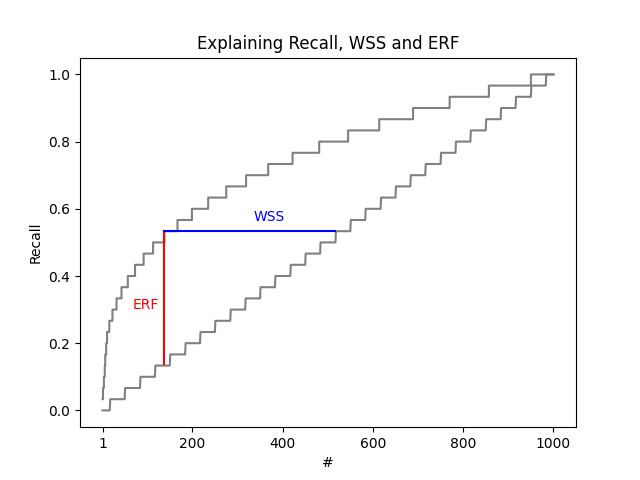
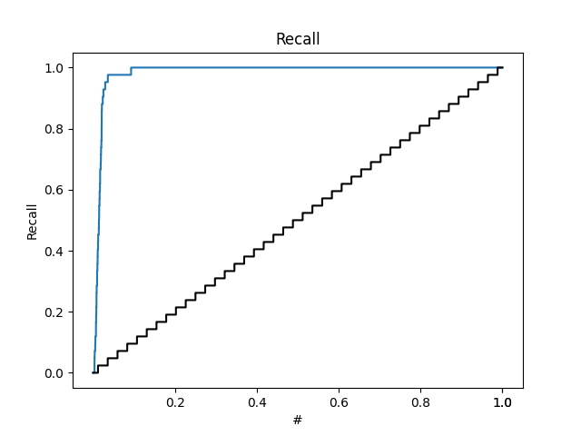
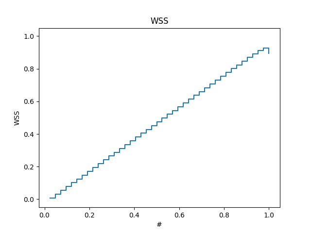
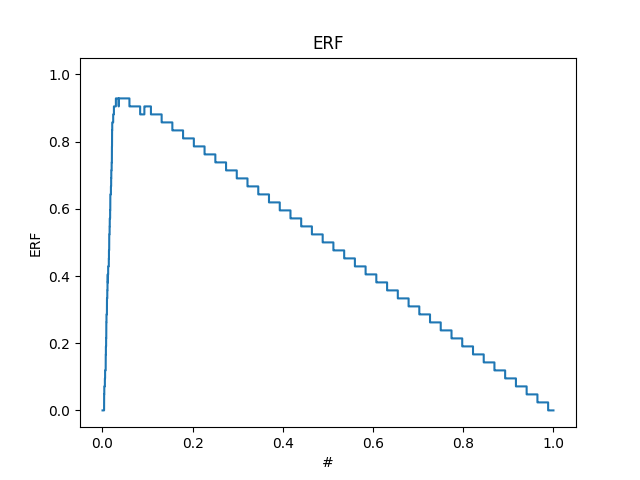
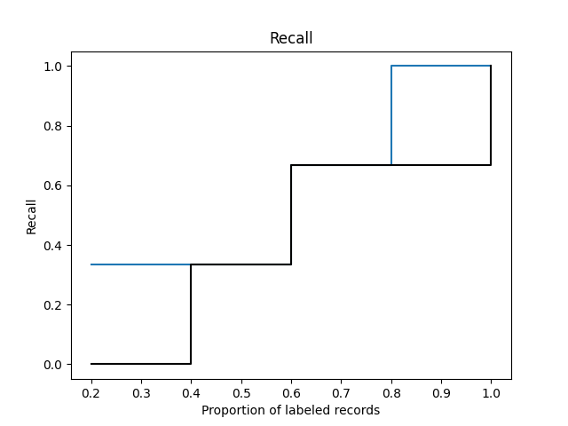
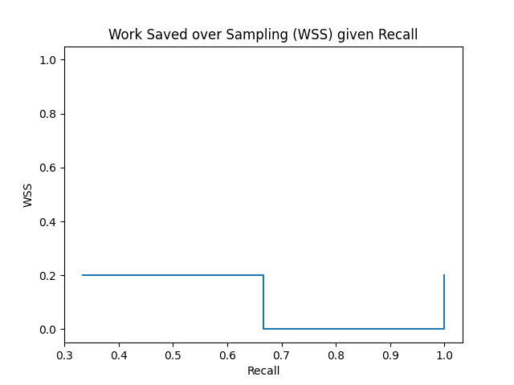
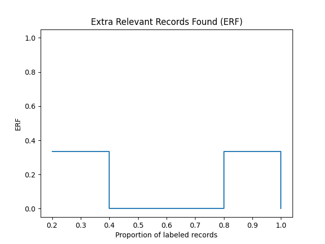
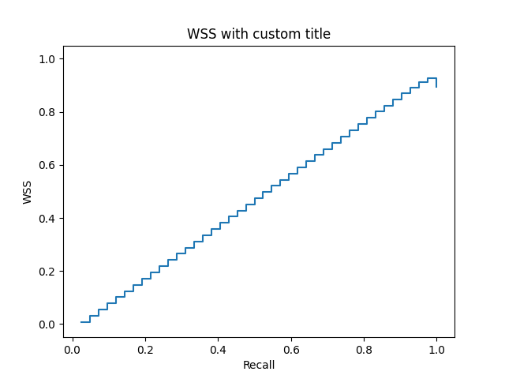
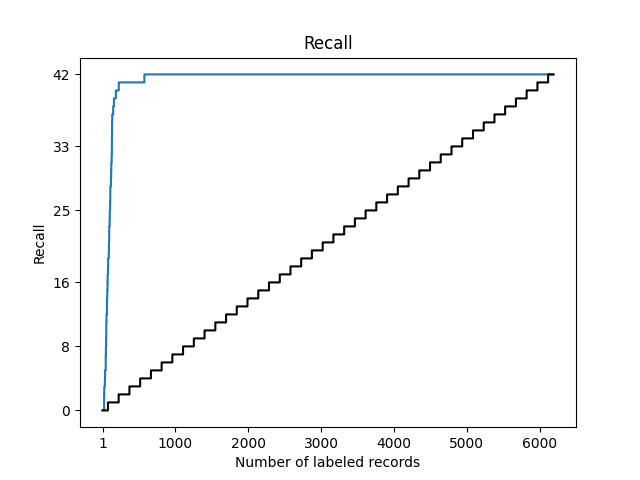
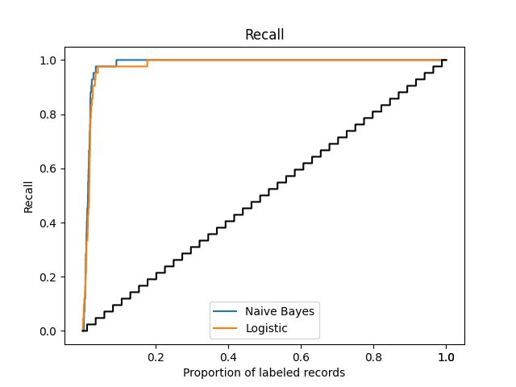

# asreview-insights

## This package is currently under development. See [ASReview-visualization](https://pypi.org/project/asreview-visualization/) for stable version compatible with ASReview LAB <=0.19.x.

[](https://badge.fury.io/py/asreview-insights) [](https://pepy.tech/project/asreview-insights)   

❣️ ASReview-insights is the successor to [ASReview-visualization](https://pypi.org/project/asreview-visualization/). ASReview insights is available for version 1 or later. Use ASReview visualization for versions 0.x.

This official extension to [ASReview
LAB](https://github.com/asreview/asreview) extends asreview with tools for
plotting and extraction of metrics and statistics. The extension is especially
useful in combination with the simulation feature of ASReview LAB.


## Installation

ASReview-insights can be installed from PyPI:

``` bash
pip install --dev asreview-insights
```

After installation, check if the ` asreview-insights` package is listed as an
extension. Use the following command:

```bash
asreview --help
```

It should list the 'plot' subcommand and the 'stats' subcommand.

## Active learning performance

The `ASReview-insights` extension is useful to measure the performance of
active learning models on collections of binary labeled text. The performance
can be measured with widely used metrics like Recall and Work Saved over
Sampling (WSS). The `ASReview-insights` extension can plot or compute metrics
from ASReview project files, ideally as the result of a simulation. See
[LINK]() for more information on simulating with ASReview LAB.

The following plot (with generated, fake data) explains the different metrics
Recall, WSS, and ERF. The dataset contains 1000 records. The stepped line on
the diagonal is the naive labeling approach (screening randomly sorted
records).




## Plots

The plots in this section are derived from an ASReview (v1.0) file generated
from

```python
asreview simulate benchmark:van_de_schoot_2017 -s sim_van_de_schoot_2017.asreview --init_seed 535
```

### Plot types

#### Recall

The recall is an important metric to study the performance of active learning
algorithms in the context of information retrieval. The ASReview Insights
offers a straightforward command line interface to plot a "recall curve". The
recall curve is the recall at any moment in the active learning process.

To plot the recall curve, you need a ASReview file (extension `.asreview`).
The file can be [exported from the ASReview LAB user interface](), or is the
[result of a simulation](). To plot the recall, use this syntax (Replace
`YOUR_ASREVIEW_FILE.asreview` by your ASReview file name.):

```bash
asreview plot recall YOUR_ASREVIEW_FILE.asreview
```

The following plot is the result of simulating the [`van_de_schoot_2017`]() in
the benchmark platform (command `asreview simulate
benchmark:van_de_schoot_2017 -s sim_van_de_schoot_2017.asreview`).



On the vertical axis, you find the recall after every labeling decision. The
number of labeling actions on the horizontal axis is equal to the number of
label actions and can't exceed the number of records in the dataset.


```bash
asreview plot recall YOUR_ASREVIEW_FILE.asreview
```

#### WSS

The Work Saved over Sampling (WSS) metric is an useful metric to study the
performance of active learning alorithms compared with a naive (random order)
approach. The ASReview Insights offers a straightforward command line
interface to plot the wss at any recall.

To plot the WSS curve, you need a ASReview file (extension `.asreview`).
The file can be [exported from the ASReview LAB user interface](), or is the
[result of a simulation](). To plot the WSS, use this syntax (Replace
`YOUR_ASREVIEW_FILE.asreview` by your ASReview file name.):

```bash
asreview plot wss YOUR_ASREVIEW_FILE.asreview
```

The following plot is the result of simulating the [`van_de_schoot_2017`]() in
the benchmark platform (command `asreview simulate
benchmark:van_de_schoot_2017 -s sim_van_de_schoot_2017.asreview`).



On the vertical axis, you find the WSS after every labeling decision. The
recall is displayed on the horizontal axis.


#### ERF

```bash
asreview plot erf YOUR_ASREVIEW_FILE.asreview
```

The following plot is the result of simulating the [`van_de_schoot_2017`]() in
the benchmark platform (command `asreview simulate
benchmark:van_de_schoot_2017 -s sim_van_de_schoot_2017.asreview`).



On the vertical axis, you find the ERF after every labeling decision. The
number of labeling actions on the horizontal axis is equal to the number of
label actions and can't exceed the number of records in the dataset.

### Very sparse datasets

Very sparse or small datasets can provide good explanation on interesting
details of the plotting subcommands in this extension. Important details are
for example the handling of prior knowledge and the computation of the recall
prediction in case of random screening.

The following plot shows the result of a collection of 4 records with 3
relevant items (inclusions). The relevant items are found in the following
order:

```
[1, 1, 0, 1, 0]
```



The black line is an estimate of the recall after every screened record in a
naive manner (also refered to as 'random').

```
Recall (est) when screening 1 = (3 relevant records / 4 records left)  / 3 = 0.25
Recall (est) when screening 2 = (1/4) * (3 relevant records / 3 records left)  / 3 +
                                (3/4) * (2 relevant records / 3 records left)  / 3 = (1/4 + 3/4*2/3) / 3 = 0.25

```

The Work Saved over Sampling (WSS) is the difference between the recall of the
simulation and the theoretical recall of random screening.



The following graph shows the recall versus the WSS. This comparison is
important because it is the fundamental of the `WSS@95%` metric used in the
literature about Active Learning for systematic reviewing.




### Plotting CLI

See `asreview plot -h` for all command line arguments.

``` bash
% asreview plot -h
usage: asreview plot [-h] [--priors] [--no-priors] [--x_absolute] [--y_absolute] [-V] [-o OUTPUT]
                     type asreview_files [asreview_files ...]

positional arguments:
  type                  Plot type. Default 'recall'.
  asreview_files        A (list of) ASReview files.

optional arguments:
  -h, --help            show this help message and exit
  --priors              Include records used as prior knowledge in the plot.
  --no-priors           Exclude records used as prior knowledge in the plot. Default.
  --x_absolute          Make use of absolute coordinates on the x-axis.
  --y_absolute          Make use of absolute coordinates on the y-axis.
  -V, --version         show program's version number and exit
  -o OUTPUT, --output OUTPUT
                        Save the plot to a file. File formats are detected by the matplotlib library, check there to see available
                        formats.
```

### Plotting API

To make use of the more advanced features, you can make use of the Python API.
The advantage is that you can tweak every single element of the plot in the
way you like. The following examples show how the Python API can be used. They
make use of matplotlib extensively. See the [Introduction to
Matplotlib](https://matplotlib.org/stable/tutorials/introductory/usage.html)
for examples on using the API.

The following example show how to plot the recall with the API and save the
result. The plot is saved using the matplotlib API.

```python
import matplotlib.pyplot as plt

from asreview import open_state
from asreviewcontrib.insights.plot import plot_recall

with open_state("example.asreview") as s:

    fig, ax = plt.subplots()

    plot_recall(ax, s)

    fig.savefig("example.png")
```

Other options are `plot_wss` and `plot_erf`.

#### Example: Customize plot

It's straightforward to customize the plots if you are familiar with
`matplotlib`. The following example shows how to update the title of the plot.

```python
import matplotlib.pyplot as plt

from asreview import open_state
from asreviewcontrib.insights.plot import plot_wss

with open_state("example.asreview") as s:

    fig, ax = plt.subplots()
    plot_wss(ax, s)

    plt.title("WSS with custom title")

    fig.savefig("example_custom_title.png")
```



#### Example: Prior knowledge

It's possible to include prior knowledge to your plot. By default, prior
knowledge is excluded from the plot.

```python
import matplotlib.pyplot as plt

from asreview import open_state
from asreviewcontrib.insights.plot import plot_wss

with open_state("example.asreview") as s:

    fig, ax = plt.subplots()
    plot_wss(ax, s, priors=True)

```

#### Example: Relative versus absolute axes

By default, all axes in ASReview-insights are relative. The API can be used to
change this behavior. The arguments are identical for each plot function.

```python
import matplotlib.pyplot as plt

from asreview import open_state
from asreviewcontrib.insights.plot import plot_wss

with open_state("example.asreview") as s:

    fig, ax = plt.subplots()
    plot_wss(ax, s, x_absolute=True, y_absolute=True)

    fig.savefig("example_absolute_axis.png")
```




#### Example: Multiple curves in one plot

It is possible to have multiple curves in one plot by using the API,
and add a legend.

```python
import matplotlib.pyplot as plt

from asreview import open_state
from asreviewcontrib.insights.plot import plot_recall


fig, ax = plt.subplots()

with open_state("tests/asreview_files/sim_van_de_schoot_2017_1.asreview") as s1:
    plot_recall(ax, s1)

with open_state("tests/asreview_files/"
                "sim_van_de_schoot_2017_logistic.asreview") as s2:
    plot_recall(ax, s2)

ax.lines[0].set_label("Naive Bayes")
ax.lines[2].set_label("Logistic")
ax.legend()

fig.savefig("docs/example_multiple_lines.png")
```



## Metrics

The metrics in ASReview-insights can be used to extract metrics at given
values. The easiest way to get metrics on a ASReview project file is with the
following command don the command line:

```
asreview stats sim_van_de_schoot_2017.asreview
```

which results in

```
{
    "metrics": {
        "recall": [
            {
                "x": 0.1,
                "y": 1.0
            },
            {
                "x": 0.25,
                "y": 1.0
            },
            {
                "x": 0.5,
                "y": 1.0
            },
            {
                "x": 0.75,
                "y": 1.0
            },
            {
                "x": 0.9,
                "y": 1.0
            }
        ],
        "wss": [
            {
                "x": 0.95,
                "y": 0.9107806691449815
            }
        ],
        "erf": [
            {
                "x": 0.95,
                "y": 0.047619047619047616
            }
        ]
    }
}
```

Each available metric has `x` and `y` values. The `x` value is the value at
which the metric is computed. In the plots above, this is the x-axis. The `y`
value is the output of the metric. Some metrics are computed for multiple
values.

| Metric | X description | Y description | Default |
|---|---|---|---|
| `recall` | Labels | Recall | 0.1, 0.25, 0.5, 0.75, 0.9 |
| `wss` | Recall | Work Saved over Sampling at recall | 0.95 |
| `erf` | Labels | ERF | 0.95 |


### Override default values

It is possible to override the default values of `asreview stats`. See
`asreview stats -h` for more information or see the example below.

```
asreview stats sim_van_de_schoot_2017.asreview --wss 0.9 0.95
```

```
{
    "metrics": {
        "recall": [
            {
                "x": 0.1,
                "y": 1.0
            },
            {
                "x": 0.25,
                "y": 1.0
            },
            {
                "x": 0.5,
                "y": 1.0
            },
            {
                "x": 0.75,
                "y": 1.0
            },
            {
                "x": 0.9,
                "y": 1.0
            }
        ],
        "wss": [
            {
                "x": 0.9,
                "y": 0.8692419589461775
            },
            {
                "x": 0.95,
                "y": 0.9107806691449815
            }
        ],
        "erf": [
            {
                "x": 0.95,
                "y": 0.047619047619047616
            }
        ]
    }
}
```

### Save metrics to file

Metrics can be saved to a file in the JSON format. Use the flag `-o` or
`--output`.

```
asreview stats sim_van_de_schoot_2017.asreview -o my_file.json
```

### Metrics CLI

See `asreview stats -h` for all command line arguments.

``` bash
% asreview stats -h
usage: asreview stats [-h] [-V] [--recall recall [recall ...]] [--wss wss [wss ...]] [--erf erf [erf ...]] [--priors] [--no-priors]
                      [--x_absolute] [--y_absolute] [-o OUTPUT]
                      asreview_files [asreview_files ...]

positional arguments:
  asreview_files        A combination of data directories or files.

optional arguments:
  -h, --help            show this help message and exit
  -V, --version         show program's version number and exit
  --recall recall [recall ...]
                        A (list of) values to compute the recall at.
  --wss wss [wss ...]   A (list of) values to compute the wss at.
  --erf erf [erf ...]   A (list of) values to compute the erf at.
  --priors              Include records used as prior knowledge in the metrics.
  --no-priors           Exclude records used as prior knowledge in the metrics. Default.
  --x_absolute          Make use of absolute coordinates on the x-axis.
  --y_absolute          Make use of absolute coordinates on the y-axis.
  -o OUTPUT, --output OUTPUT
                        Save the statistics and metrics to a JSON file.
```

### Metrics API

Metrics are easily accesible with the `ASReview-insights` API.

Compute the recall after reading half of the dataset.

```python

from asreview import open_state
from asreviewcontrib.insights.metrics import recall

with open_state("example.asreview") as s:

    print(recall(s, 0.5))
```

Other metrics are available like `wss` and `erf`.

#### Example: Prior knowledge

It's possible to include prior knowledge to your metric. By default, prior
knowledge is excluded from the metric.

```python

from asreview import open_state
from asreviewcontrib.insights.metrics import recall

with open_state("example.asreview") as s:

    print(recall(s, 0.5, priors=True))
```

## License

This extension is published under the [MIT license](/LICENSE).

## Contact

This extension is part of the ASReview project ([asreview.ai](https://asreview.ai)). It is maintained by the
maintainers of ASReview LAB. See [ASReview
LAB](https://github.com/asreview/asreview) for contact information and more
resources.
