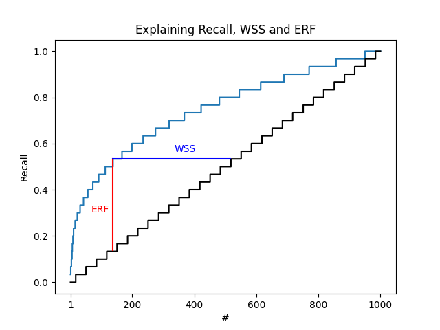

# asreview-insights


This official extension to [ASReview
LAB](https://github.com/asreview/asreview) extends asreview with tools for
plotting and extraction of metrics and statistics. The extension is especially
useful in combination with the simulation feature of ASReview LAB.


## Installation

ASReview-insights can be installed from PyPI:

``` bash
pip install asreview-insights
```

After installation, check if the ` asreview-insights` package is listed as an
extension. Use the following command:

```bash
asreview --help
```

It should list the 'plot' subcommand and the 'stats' subcommand.

## Active learning performance

The `ASReview-insights` extension is useful to measure the performance of
active learning models on collections of binary labeled text. The performance
can be measured with widely used metrics like Recall and Work Saved over
Sampling (WSS). The `ASReview-insights` extension can plot or compute metrics
from ASReview project files, ideally as the result of a simulation. See
[LINK]() for more information on simulating with ASReview LAB.

The following plot (with generated, fake data) explains the different metrics
Recall, WSS, and ERF. The dataset contains 1000 records. The stepped line on
the diagonal is the naive labeling approach (screening randomly sorted
records).




## Plots

The plots in this section are derived from an ASReview (v1.0) file generated
from

```python
asreview simulate benchmark:van_de_schoot_2017 -s sim_van_de_schoot_2017.asreview --seed_init 535
```

### Recall

The recall is an important metric to study the performance of active learning
alorithms in the context of information retrieval. The ASReview Insights
offers a straightforward command line interface to plot a "recall curve". The
recall curve is the recall at any moment in the active learning process.

To plot the recall curve, you need a ASReview file (extension `.asreview`).
The file can be [exported from the ASReview LAB user interface](), or is the
[result of a simulation](). To plot the recall, use this syntax (Replace
`YOUR_ASREVIEW_FILE.asreview` by your ASReview file name.):

```bash
asreview plot recall YOUR_ASREVIEW_FILE.asreview
```

The following plot is the result of simulating the [`van_de_schoot_2017`]() in
the benchmark platform (command `asreview simulate
benchmark:van_de_schoot_2017 -s sim_van_de_schoot_2017.asreview`).


On the vertical axis, you find the recall after every labeling decision. The
number of labeling actions on the horizontal axis is equal to the number of
label actions and can't exceed the number of records in the dataset.

### WSS

The Work Saved over Sampling (WSS) metric is an useful metric to study the
performance of active learning alorithms compared with a naive (random order)
approach. The ASReview Insights offers a straightforward command line
interface to plot the wss at any recall.

To plot the WSS curve, you need a ASReview file (extension `.asreview`).
The file can be [exported from the ASReview LAB user interface](), or is the
[result of a simulation](). To plot the WSS, use this syntax (Replace
`YOUR_ASREVIEW_FILE.asreview` by your ASReview file name.):

```bash
asreview plot wss YOUR_ASREVIEW_FILE.asreview
```

The following plot is the result of simulating the [`van_de_schoot_2017`]() in
the benchmark platform (command `asreview simulate
benchmark:van_de_schoot_2017 -s sim_van_de_schoot_2017.asreview`).


On the vertical axis, you find the WSS after every labeling decision. The
recall is displayed on the horizontal axis.


### ERF

```bash
asreview plot erf YOUR_ASREVIEW_FILE.asreview
```

The following plot is the result of simulating the [`van_de_schoot_2017`]() in
the benchmark platform (command `asreview simulate
benchmark:van_de_schoot_2017 -s sim_van_de_schoot_2017.asreview`).


On the vertical axis, you find the ERF after every labeling decision. The
number of labeling actions on the horizontal axis is equal to the number of
label actions and can't exceed the number of records in the dataset.

## Small datasets

Small datasets can provide good insights on interesting details of the
plotting subcommands in this extension. Important details are for example the
handling of prior knowledge and the computation of the recall prediction in
case of random screening.

The following plot shows the result of a collection of 4 records with 3
relevant items (inclusions). The relevant items are found in the following
order:

```
[1, 1, 1, 0]
```


The random line is a step functions that estimates the recall after every
screened record.

```
Recall (est) when screening 1 = (3 relevant records / 4 records left)  / 3 = 0.25
Recall (est) when screening 2 = (1/4) * (3 relevant records / 3 records left)  / 3 +
                                (3/4) * (2 relevant records / 3 records left)  / 3 = (1/4 + 3/4*2/3) / 3 = 0.25

```

The Work Saved over Sampling (WSS) is the difference between the recall of the
simulation and the theoretical recall of random screening.


The following graph shows the recall versus the WSS. This comparison is
important because it is the fundamental of the `WSS@95%` metric used in the
literature about Active Learning for systematic reviewing.


## API

To make use of the more advanced features, you can make use of the Python API.
The advantage is that you can tweak every single element of the plot in the
way you like. The following examples show how the Python API can be used. They
make use of matplotlib extensively. See the [Introduction to
Matplotlib](https://matplotlib.org/stable/tutorials/introductory/usage.html)
for examples on using the API.

### Plot using the API

The following example show how to plot the recall with the API and save the
result. The plot is saved using the matplotlib API.

```python
import matplotlib.pyplot as plt

from asreview import open_state
from asreviewcontrib.insights.plot import plot_recall

with open_state("example.asreview") as s:

    fig, ax = plt.subplots()

    plot_recall(ax, s)

    fig.savefig("example.png")
```

Other options are `plot_wss` and `plot_erf`.

### Customize plot

It's straightforward to customize the plots if you are familiar with
`matplotlib`. The following example shows how to update the title of the plot.

```python
import matplotlib.pyplot as plt

from asreview import open_state
from asreviewcontrib.insights.plot import plot_wss

with open_state("example.asreview") as s:

    fig, ax = plt.subplots()
    plot_wss(ax, s)

    plt.title("WSS with custom title")

    fig.savefig("example_custom_title.png")
```


### Prior knowledge

It's possible to include prior knowledge to your plot. By default, prior
knowledge is excluded from the plot.

```python
import matplotlib.pyplot as plt

from asreview import open_state
from asreviewcontrib.insights.plot import plot_wss

with open_state("example.asreview") as s:

    fig, ax = plt.subplots()
    plot_wss(ax, s, priors=True)

```

### Relative versus absolute axes

By default, all axes in ASReview-insights are relative. The API can be used to
change this behavior. The arguments are identical for each plot function.

```python
import matplotlib.pyplot as plt

from asreview import open_state
from asreviewcontrib.insights.plot import plot_wss

with open_state("example.asreview") as s:

    fig, ax = plt.subplots()
    plot_wss(ax, s, x_relative=False, y_relative=False)

    fig.savefig("example_absolute_axis.png")
```


## License

This extension is published under the [MIT license](/LICENSE).

## Contact

This extension is part of the ASReview project. It is maintained by the
maintainers of ASReview LAB. See [ASReview
LAB](https://github.com/asreview/asreview) for contact information and more
resources.
